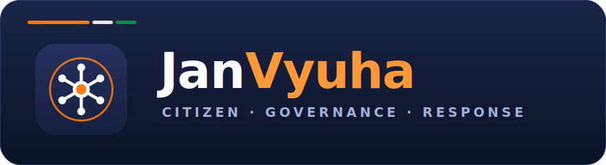
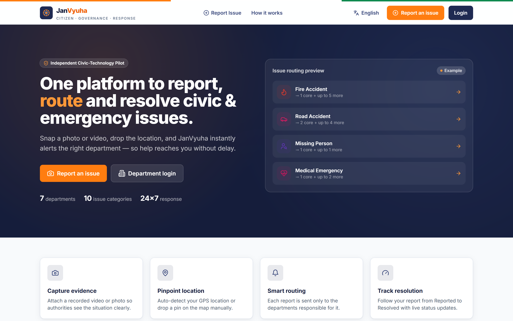
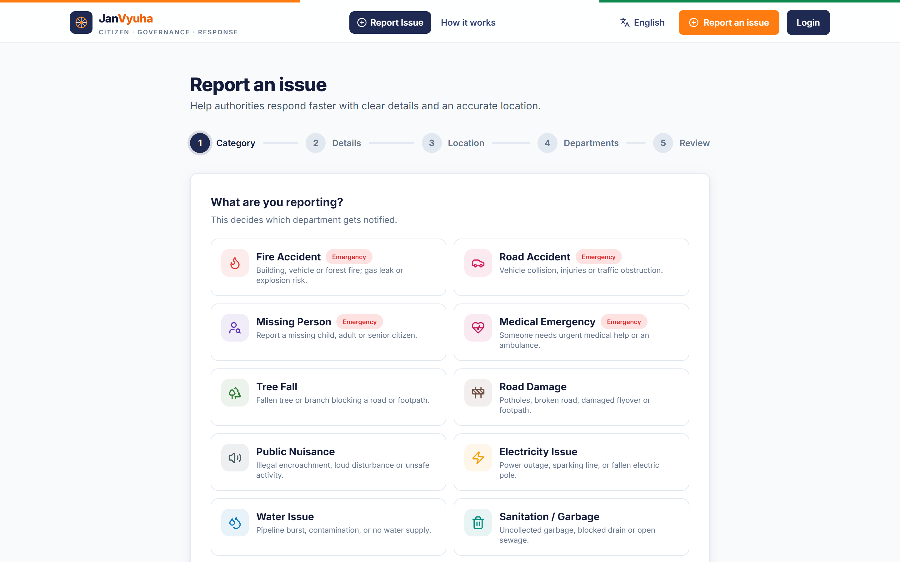
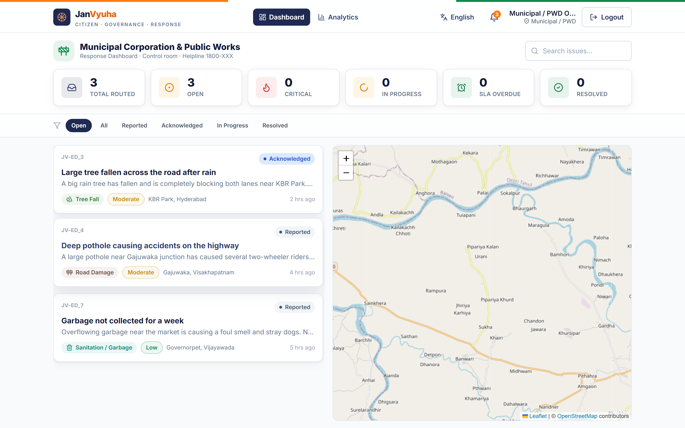
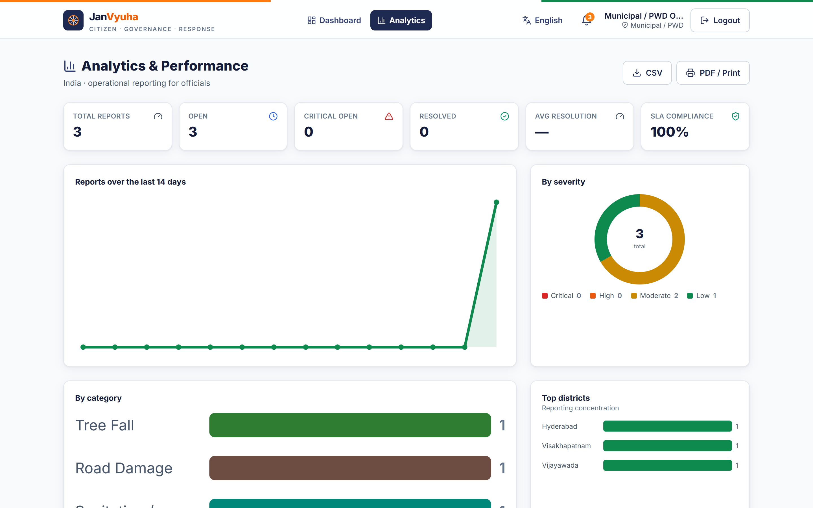
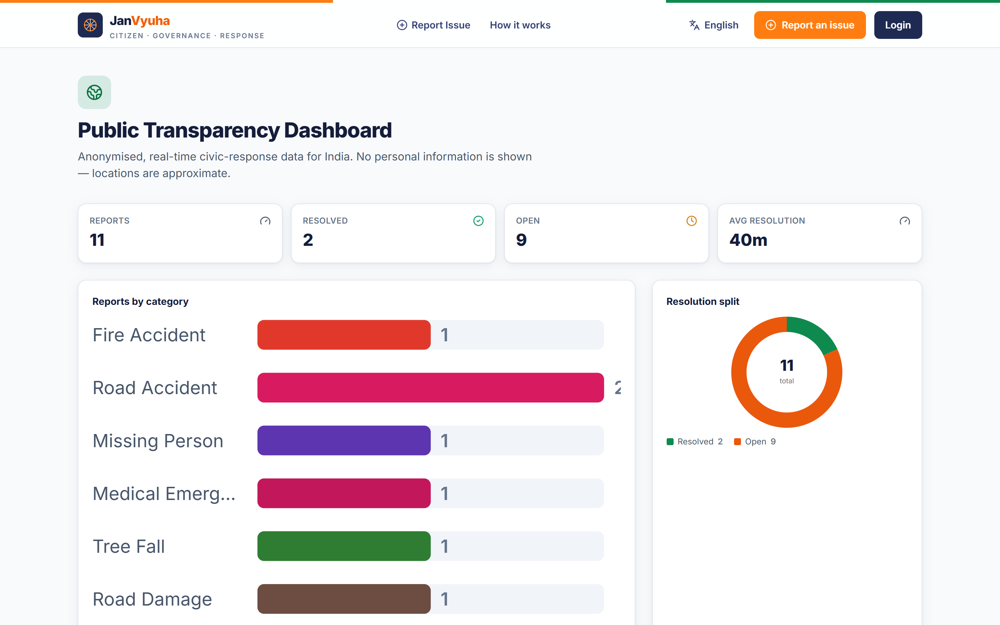
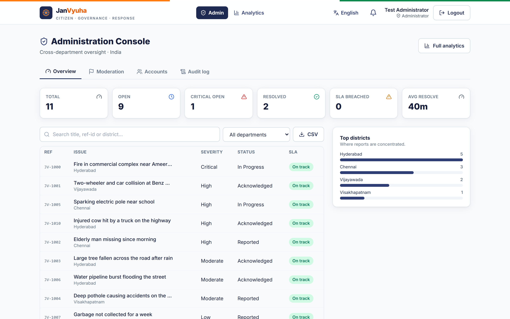

<div align="center">



### Citizen reporting, routed to the right responders.

A civic-technology platform for India where citizens report society & emergency
issues with a **photo/video + map location**, and each report is **routed by
category to the right government department(s)** — so help reaches the people who
can actually act on it.

<sub>React · TypeScript · Vite · Tailwind · Supabase · Google Gemini · Leaflet/OpenStreetMap · Vercel</sub>

</div>

---

## Overview

A fire accident reaches **Fire + Ambulance** and appears on **their** dashboards
only — never Police or Electricity. A missing-person report goes to **Police**. A
burst pipeline goes to the **Water Board**. Visibility and notifications are driven
by a single routing source of truth and, on the real backend, enforced by Postgres
**Row-Level Security** — not just hidden in the UI.

The platform is built to run at **zero cost** on free tiers, is **multilingual**
(English · हिन्दी · తెలుగు · தமிழ்), installable as a **PWA**, and ships as a
**white-label** build that can be presented under a neutral or state-specific brand.

> **Runs with no setup at all** in a built-in demo mode (in-browser mock data).
> Real integrations light up as you add keys.

---

## Screenshots

|  |  |
|:--:|:--:|
| **Landing — issue routing at a glance** | **Report wizard — guided, 5 steps** |
|  |  |
| **Department dashboard — only routed issues** | **Analytics — SLA & performance** |
|  |  |
| **Public transparency dashboard** | **Administration console** |
|  |  |

---

## Key features

- **Category-based routing** — each report reaches only the responsible
  department(s), with life-safety services (Ambulance) pre-selected by default.
- **Evidence + precise location** — attach a photo/video, auto-detect GPS or drop a
  pin on an OpenStreetMap map with forward/reverse geocoding.
- **AI triage assist** — Google Gemini reads the photo + description and suggests
  category, severity and a clean title (server-side key; graceful fallback).
- **Department dashboards** — live queue, status workflow, map, search and filters,
  scoped to what each department is allowed to see.
- **Officials' analytics** — SLA compliance, average resolution time, breakdowns by
  severity / category / district, CSV & print export.
- **Administration console** — account provisioning (invite-only), moderation queue,
  and an audit log for cross-department oversight.
- **Public transparency dashboard** — anonymised, real-time civic-response data with
  no personal information exposed.
- **Security by design** — Row-Level Security for department isolation, invite-only
  official accounts (no self-registration), private evidence storage with signed
  URLs, and DPDP-aligned privacy pages with a right-to-erasure flow.
- **Multilingual, accessible, offline-capable** — EN/HI/TE/TA, keyboard & reduced-
  motion support, and a PWA offline shell with Web Push notifications.

---

## Quick start (demo mode — no accounts needed)

```bash
npm install
npm run dev          # http://localhost:5173
```

Everything works against seeded mock data. Open the **Tester** button (bottom-left)
to switch roles, log in as any department instantly, reset data, and mock the AI.

> If `npm run dev` complains about esbuild, run `npm rebuild esbuild` once.

### Tester Mode

A dev-only control panel (always on in `npm run dev`; in production only when
`VITE_ENABLE_TESTER=true`). It lets you **instantly log in** as General Public, any
of the 7 departments, or an Administrator — no credentials — plus switch backend,
toggle mock AI, reseed demo data, and jump to any screen. Use it to verify the core
guarantee: a **Fire Accident** shows for **Fire** and **Ambulance** only.

---

## Going live (all free tiers)

### 1) Supabase — database, auth, storage, realtime

1. Create a free project at <https://supabase.com> (no credit card).
2. **SQL Editor** → paste [`supabase/schema.sql`](supabase/schema.sql) → **Run**.
   Creates tables, **Row-Level Security** for department isolation, a private storage
   bucket, and enables realtime.
3. Optional demo data: run [`supabase/seed.sql`](supabase/seed.sql).
4. **Settings → API** → copy the **Project URL** and **anon public** key into `.env`:

```bash
VITE_SUPABASE_URL=https://YOUR-PROJECT.supabase.co
VITE_SUPABASE_ANON_KEY=eyJhbGciOi...
```

> **Why this matters:** the "only the routed department can see an issue" rule is
> enforced by Postgres **Row-Level Security**, not just the UI.

### 2) Google Gemini — Vision AI triage

Get a free key at <https://aistudio.google.com/app/apikey> and add it as a
**server-side** variable (no `VITE_` prefix):

```bash
GEMINI_API_KEY=AIza...
```

The key stays server-side in [`api/analyze.ts`](api/analyze.ts) and is never shipped
to the browser. Without it, the app simply hides the AI button.

### 3) Deploy to Vercel

```bash
npm i -g vercel
vercel                 # follow prompts
vercel env add VITE_SUPABASE_URL
vercel env add VITE_SUPABASE_ANON_KEY
vercel env add GEMINI_API_KEY
vercel --prod
```

[`vercel.json`](vercel.json) is preconfigured (SPA rewrites + the `api/analyze`
function). See [`docs/deploy-guide.md`](docs/deploy-guide.md) for a full walkthrough.

---

## Environment variables

| Var | Where | Purpose |
|---|---|---|
| `VITE_SUPABASE_URL` | client | Supabase project URL |
| `VITE_SUPABASE_ANON_KEY` | client | Supabase anon key (safe to expose) |
| `GEMINI_API_KEY` | **server only** | Gemini key for `/api/analyze` |
| `ALLOWED_ORIGINS` | **server only** | Comma-list of origins allowed to call `/api/analyze` |
| `VITE_BRAND` | client | White-label preset: `neutral`/`telangana`/`andhra`/`tamilnadu`/`national` |
| `VITE_DEFAULT_LOCALE` | client | Default UI language `en`/`hi`/`te`/`ta` |
| `VITE_VAPID_PUBLIC_KEY` | client | Web Push public key |
| `VAPID_PRIVATE_KEY` / `VAPID_SUBJECT` | **server only** | Web Push signing (`/api/notify`) |
| `SUPABASE_SERVICE_ROLE_KEY` | **server only** | Lets `/api/notify` read push subscriptions |
| `EMAIL_API_KEY` / `EMAIL_FROM` | **server only** | Optional transactional email (free tier) |
| `VITE_BACKEND` | client | Force `mock` or `supabase` (optional) |
| `VITE_ENABLE_TESTER` | client | Allow Tester Mode in production builds |

See [`.env.example`](.env.example). `.env` is git-ignored. Every key is optional —
the app runs in demo mode with none of them.

---

## How routing works

[`src/data/categories.ts`](src/data/categories.ts) holds `CATEGORIES` — the single
source of truth for **notifications and visibility**. Each category has a **`core`**
list (always alerted) plus **`conditional`** departments added only when the context
warrants it: the AI or a keyword match flags them and the citizen confirms in the
wizard, so no unrelated department is ever alerted. On the mock backend this filters
the dashboards; on Supabase the resolved set is stored in `issues.routed_departments`
and enforced by RLS.

| Category | Core (always) | May also alert (conditional) |
|---|---|---|
| Fire Accident | Fire | Ambulance*, Electricity, Police, Municipal, Animal Welfare |
| Road Accident | Police + Ambulance | Fire, Municipal, Electricity, Animal Welfare |
| Missing Person | Police | Ambulance |
| Medical Emergency | Ambulance | Police, Fire |
| Tree Fall | Municipal | Fire, Electricity, Police, Ambulance, Animal Welfare |
| Road Damage | Municipal / PWD | Police, Water |
| Public Nuisance | Police | Municipal |
| Electricity Issue | Electricity Board | Fire, Ambulance, Municipal |
| Water Issue | Water Board | Municipal, Electricity |
| Sanitation / Garbage | Municipal | Water, Animal Welfare |

<sub>\* pre-selected by default (life-safety). **Animal Welfare** is the 7th
department — alerted whenever an incident involves injured, trapped or stray animals
(e.g. a road accident with an injured cow).</sub>

---

## Tech stack

- **React 18 + Vite + TypeScript + Tailwind CSS**
- **Supabase** — Postgres + Auth + Storage + Realtime + Row-Level Security
- **Google Gemini** (Vision) via a Vercel serverless proxy
- **Leaflet + OpenStreetMap + Nominatim** — maps, pin-drop, forward/reverse geocoding
- **Zustand** state · **react-i18next** (EN/HI/TE/TA) · **react-hot-toast** · **PWA** (installable + offline shell + Web Push)

## Scripts

```bash
npm run dev        # dev server
npm run build      # typecheck + production build
npm run preview    # preview the production build
npm run typecheck  # tsc --noEmit
npm test           # vitest
```

## Project layout

```
api/analyze.ts            Vercel serverless — Gemini proxy (server-side key)
api/notify.ts             Vercel serverless — Web Push / email notifications
supabase/schema.sql       Tables, RLS, storage, realtime
supabase/seed.sql         Optional demo data
docs/                     Pitch & operations docs (see docs/README.md)
src/
  config/                 brand / white-label presets
  data/                   categories, routing, types, mock seed
  services/               api (mock) · supabaseApi · index (selector) · ai
  store/                  auth · issues (realtime) · testMode
  lib/                    supabase, config, i18n, leaflet, geocode, format
  locales/                en · hi · te · ta translations
  components/             Header, TesterPanel, NotificationBell, MapView, ...
  pages/                  Landing, Login*, ReportIssue, MyIssues, Dashboard,
                          Analytics, AdminDashboard, Transparency, IssueDetail, info
```

---

## For government reviewers

JanVyuha is a **white-label, zero-cost, multilingual** civic-response platform,
presented as an **independent pilot proposal** (not yet an official government
service). Full official-facing documentation is in [`docs/`](docs/README.md):
one-pager, pitch deck, pilot proposal, architecture, **security & DPDP** overview,
SLA/KPI definitions, deployment guide and an honest **scaling & cost** analysis.

Officials can never self-register. To bootstrap the first administrator, insert an
invite for your email in the SQL editor, then sign up with that email:

```sql
insert into public.department_invites (email, role) values ('you@example.gov.in', 'admin');
```

You'll be provisioned as `admin` automatically on sign-up, and can then provision
department accounts from the Admin console.

---

## License

**Copyright © 2026 JanVyuha. All rights reserved.**

This project is proprietary. No permission is granted to copy, modify, distribute,
sublicense, or use this software or its source, in whole or in part, without the
prior written consent of the copyright holder. It is published here for evaluation
and demonstration purposes only. See [`LICENSE`](LICENSE) for the full terms.
